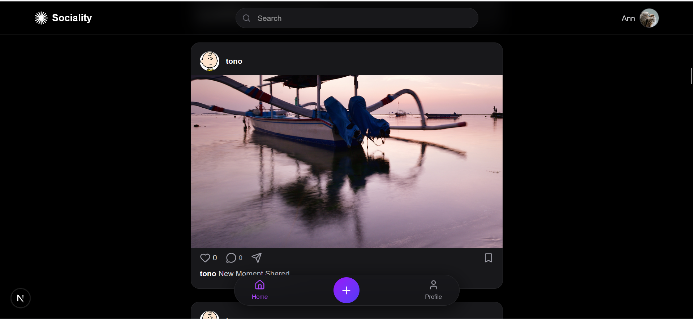
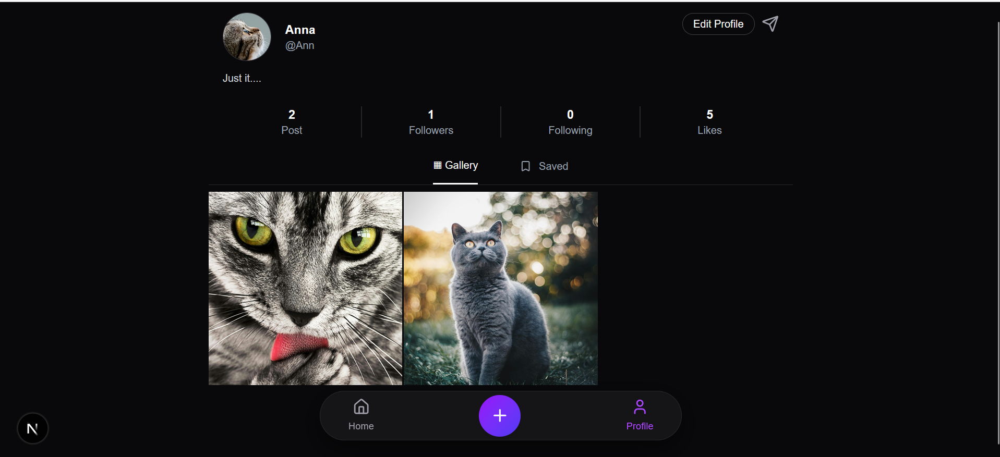
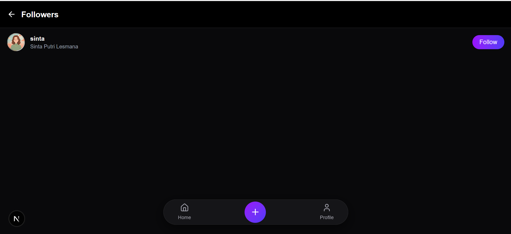
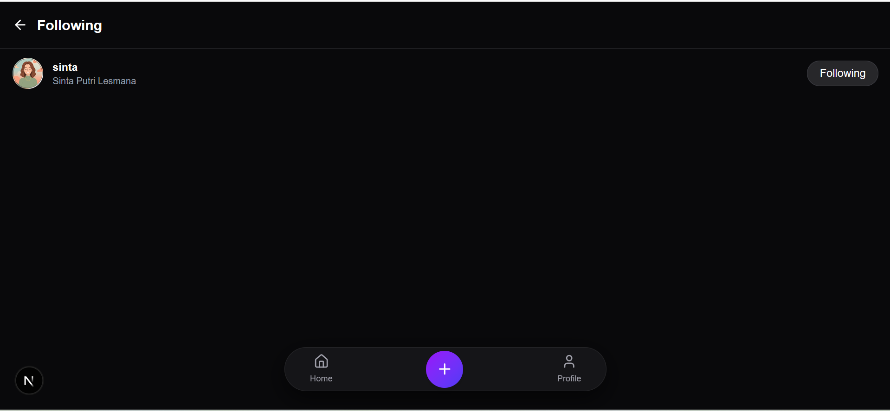
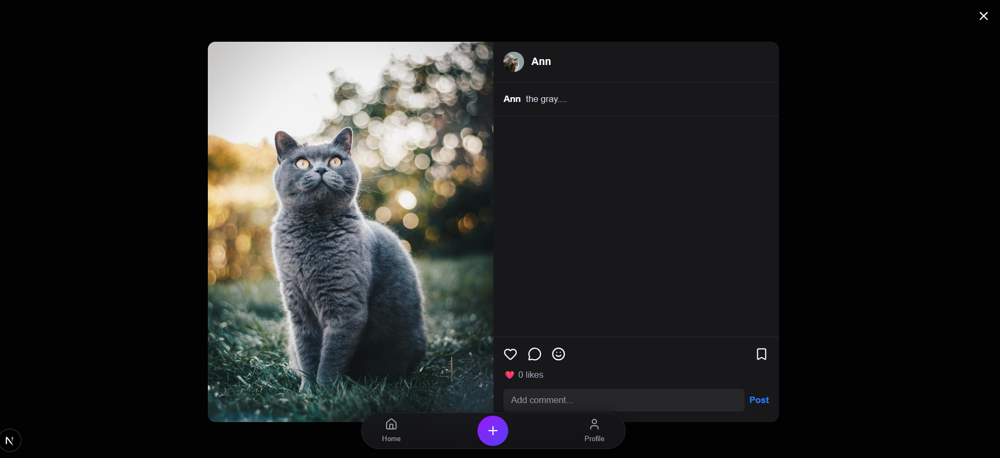
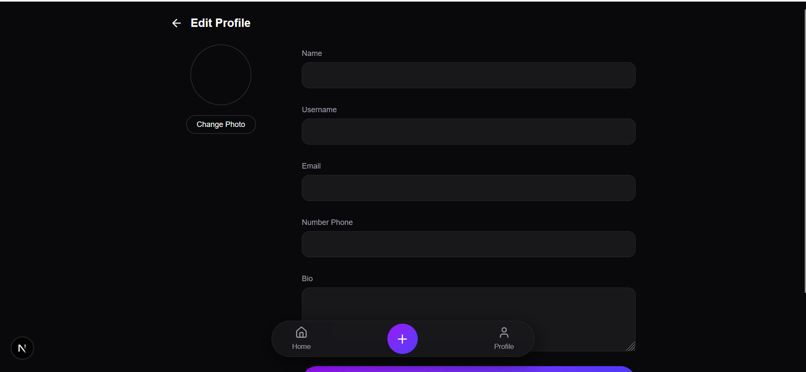

# 📱 Social Media App (Frontend)

A modern social media application built with **Next.js** and **TypeScript**, featuring user authentication, profile management, post creation, likes, follows, and responsive user interfaces. This project focuses on building a real-world social media experience with clean architecture, modern UI, and efficient server-state management.

---
## ✨ Highlights

- 🔐 JWT Authentication
- 👤 Dynamic User Profiles
- 📸 Instagram-style Post Feed
- 👥 Follow & Unfollow System
- ⚡ TanStack Query Data Fetching
- 📱 Fully Responsive Design

---

## 🚀 Features

### 🔐 Authentication
- User Login & Register
- JWT Authentication
- Protected Routes

### 👤 User Profiles
- View user profiles
- Edit profile information
- Avatar & bio management
- Dynamic profile routing (`/users/[username]`)

### 📸 Posts
- Create and display posts
- Instagram-style post grid
- Post detail page
- Like posts
- Responsive media display

### 👥 Follow System
- Follow & Unfollow users
- Followers & Following pages
- Mutual follow indicator
- Real-time follow status updates

### 📊 User Dashboard
- View personal profile
- Profile statistics
  - Posts
  - Followers
  - Following
- Share profile

### 🎨 UI / UX
- Responsive mobile-first design
- Instagram-inspired interface
- Skeleton loading states
- Empty state handling
- Sticky navigation
- Smooth page transitions with Framer Motion

---

## 🧰 Tech Stack

- Next.js
- React
- TypeScript
- Tailwind CSS
- TanStack Query
- Axios
- Framer Motion
- Lucide React
---

## 🧠 State Management

### TanStack Query

- `useQuery` → Fetch posts, profiles, followers, and following data
- `useMutation` → Login, follow/unfollow users, create posts, update profiles
- Automatic caching & background refetching
- Optimistic UI for smooth user experience (where applicable)

---

## 🔄 Main User Flow

1. Login / Register
2. Browse posts
3. Visit user profiles
4. Follow / Unfollow users
5. Create and interact with posts
6. Edit profile
7. View followers & following lists

---

## 🎨 UI / UX Principles

- Responsive design using Tailwind CSS
- Component-based architecture
- Smooth animations with Framer Motion
- Loading & empty states
- Modern Instagram-inspired layout
- Clean and intuitive user experience

---


## 📂 Folder Structure

```text
src/
├── app/
├── components/
├── features/
├── hooks/
├── lib/
├── services/
├── types/

```

---

## 📦 Installation

```bash
# Clone repository
git clone https://github.com/Anna-fertiliana/Project-2-Social-Media-App.git

# Go to project folder
cd social-media-app

# Install dependencies
npm install

# Run development server
npm run dev
```

---

## 🔧 Environment Variables

Create a `.env.local` file:

```env
NEXT_PUBLIC_API_BASE_URL=your_api_url_here
```

---

## 🌐 API Reference

This project consumes a RESTful API backend for authentication, user management, posts, and follow relationships.

Configure the API endpoint using:

```env
NEXT_PUBLIC_API_BASE_URL=your_api_url_here

---

## 📸 Screenshots

### 🏠 Home Feed



Displays the main feed where users can browse posts from the community.

---

### 👤 User Profile



Displays the user's profile information, post gallery, follower statistics, and profile actions.

---

### 👥 Followers & Following




Displays followers and following lists with real-time follow status.

---

### 📸 Post Detail



View full post content and user interactions.

---

### ✏️ Edit Profile



Allows users to update profile information and avatar.

---

## 🚀 Project Status

- ✅ Authentication (Login & Register)
- ✅ User Profiles
- ✅ Post Feed
- ✅ Follow & Unfollow System
- ✅ Likes
- ✅ Protected Routes
- ✅ Responsive UI

---

## ⚠️ Error Handling

- API request fallback
- Loading states
- Empty state UI
- Form validation
- Unauthorized redirect

---

## 🚀 Deployment

This project is deployed on **Vercel**.

🔗 **Live Demo**

[View Live Demo](https://project-2-git-main-anna-fertilianas-projects.vercel.app/)

🔗 **Repository**

[View Source Code](https://github.com/Anna-fertiliana/Project-2-Social-Media-App)

---

## 👨‍💻 Author

Developed as part of my personal portfolio to demonstrate my skills in building modern, responsive, and scalable web applications using Next.js, TypeScript, and contemporary frontend technologies.

---

## 📄 License

This project is part of my personal portfolio and demonstrates my skills in building modern web applications using Next.js and TypeScript. Feel free to explore and use it as a reference.